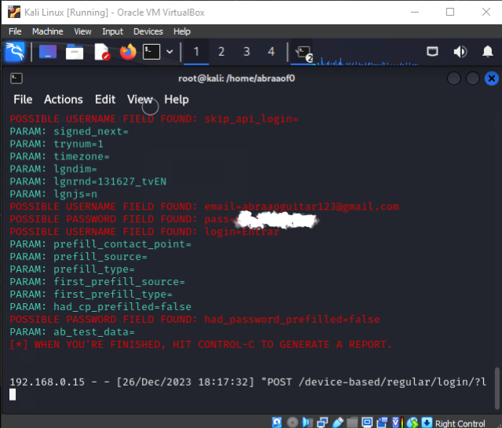

# Phishing para Captura de Credenciais do Facebook

## Ferramentas Utilizadas

- Sistema Operacional: Kali Linux
- Framework: setoolkit

## Configuração do Phishing no Kali Linux

1. Faça login no Kali Linux como root: 
    
   - sudo su
    

2. Inicie o setoolkit:
    
   - setoolkit
   

3. Selecione o tipo de ataque:
   - Tipo de ataque: `Social-Engineering Attacks`

4. Escolha o vetor de ataque:
   - Vetor de ataque: `Web Site Attack Vectors`

5. Escolha o método de ataque:
   - Método de ataque: `Credential Harvester Attack Method`

6. Selecione o método específico:
   - Método de ataque: `Site Cloner`

7. Obtenha o endereço da sua máquina:
   
   - ifconfig
    

8. Informe a URL para clonar:
   - URL para clone: http://www.facebook.com

## Cuidados Importantes

Este projeto é destinado exclusivamente para fins educacionais como parte do Desafio de Cibersegurança da plataforma de ensino Dio.me.

## Resultados do Phishing

